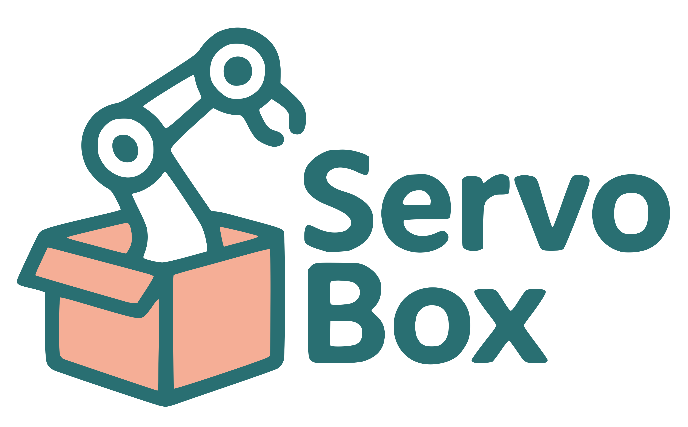

# ServoBox

<div align="center">
  
</div>

<p align="center">
  <a href="https://github.com/kvasios/servobox/actions/workflows/release.yml">
    
  </a>
  <a href="https://github.com/kvasios/servobox/releases">
    
  </a>
  <a href="https://www.servobox.dev/">
    
  </a>
</p>

ServoBox launches Ubuntu 22.04 PREEMPT_RT environments for robotics without turning your whole workstation into an RT system. It gives you automatic CPU pinning, IRQ isolation, built-in latency checks, external recipe-channel installs for common robotics stacks, and as of `0.3.0`, support for remote RT targets over SSH.

## Quick Start

Full setup instructions, host RT configuration, and usage guides live at [servobox.dev](https://www.servobox.dev/).

One-line install:

```bash
curl -fsSL https://www.servobox.dev/install.sh | sudo bash
```

Create, start, and validate your first RT VM:

```bash
servobox init
servobox start
servobox rt-verify
servobox test --duration 30 --stress-ng
```

Before running latency-sensitive workloads, follow the host setup guide:
[Installation and Host RT Setup](https://www.servobox.dev/getting-started/installation/)

Project-local defaults can live in `.servobox/config`:

```bash
servobox config init
servobox init
servobox pkg-install
servobox run
```

Use `.servobox/config` for VM sizing, RT mode, package install defaults, custom recipe paths, and the default run workflow for a client project.

## What It Covers

- Local real-time VMs for robotics and control workloads
- Automatic CPU pinning, IRQ steering, and RT verification
- Package install and run helpers backed by the external ServoBox recipe channel
- Remote target mode for Jetson, NUC, and other SSH-reachable RT machines

## Documentation

- Start here: [servobox.dev](https://www.servobox.dev/)
- Install and host setup: [Getting Started](https://www.servobox.dev/getting-started/installation/)
- First VM workflow: [First Run](https://www.servobox.dev/getting-started/run/)
- Commands and packages: [User Guide](https://www.servobox.dev/user-guide/commands/)
- RT tuning and troubleshooting: [Reference](https://www.servobox.dev/reference/rt-tuning/)

## License

ServoBox is released under the [MIT License](LICENSE).
