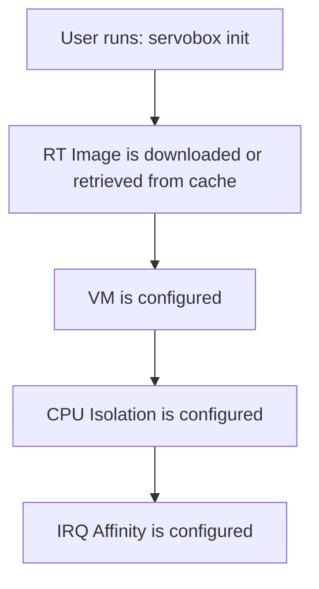

# Overview

## What is ServoBox?

ServoBox is a specialized tool for creating and managing real-time virtual machines optimized for robotics development. It eliminates the complexity of setting up PREEMPT_RT environments by automating kernel configuration, CPU isolation, and IRQ management.

## Why ServoBox?

### The Problem

Setting up a real-time Linux environment for robotics is challenging:

- **Complex Configuration** - Kernel parameters, CPU isolation, IRQ affinity require deep knowledge
- **Time-Consuming** - Manual setup can take hours or days
- **Hard to Reproduce** - Sharing RT environments across teams is difficult

### Why Not Ubuntu Pro RT Kernel?

Ubuntu Pro provides easy RT kernel installation, but has critical limitations for robotics workstations:

**NVIDIA GPU Conflicts:** Ubuntu Pro RT kernels break NVIDIA proprietary drivers, preventing GPU acceleration for ML/vision.

**Throughput Sacrifice:** RT kernels optimize the entire system for latency, degrading performance of high-throughput workloads (ML training, data processing, perception).

**ServoBox approach:** Keep host on standard kernel with full GPU support and high throughput, isolate RT workloads to dedicated CPU cores in VMs.

### The Solution

ServoBox provides:

- **One-Command Setup** - `servobox init` creates a fully configured RT VM
- **Automatic Tuning** - CPU pinning and IRQ isolation happen automatically
- **Validated Images** - Pre-tested PREEMPT_RT kernel (6.8.0-rt8)
- **Package Recipes** - Install common robotics control software easily
- **Performance Testing** - Built-in cyclictest to validate RT characteristics
- **Host Isolation** - RT VMs don't interfere with host GPU, ML, or perception workloads

## How It Works

When you run `servobox init`, it automatically performs all these steps:

1. **Image Management** - Downloads or uses pre-built Ubuntu 22.04 RT images
2. **VM Creation** - Configures QEMU/KVM with optimal settings
3. **CPU Isolation** - Pins vCPUs to isolated host cores
4. **IRQ Management** - Steers interrupts away from RT cores
5. **Cloud-Init** - Automatic SSH key setup and networking

**Key Principle:** ServoBox VMs handle **real-time control** while the host handles **high-level processing** like perception, planning, and user interfaces.

## Key Concepts

### PREEMPT_RT Kernel

The Real-Time Linux kernel patch that provides deterministic scheduling and low-latency guarantees.

### CPU Isolation

Dedicating specific CPU cores exclusively to RT tasks by removing them from the Linux scheduler.

### IRQ Affinity

Directing hardware interrupts to specific CPUs (away from RT cores) to prevent latency spikes.

### vCPU Pinning

Binding virtual machine CPUs to specific physical CPU cores for consistent performance.

## Host-VM Separation Principle

ServoBox follows a **separation of concerns** architecture:

### VM Responsibilities (Real-Time)
- **Control loops** - 1kHz+ deterministic control
- **Low-level robot interfaces** - Direct hardware communication
- **Time-critical algorithms** - Motion control, force control
- **RT scheduling** - Guaranteed timing constraints

### Host Responsibilities (High-Level)
- **Perception processing** - Computer vision, sensor fusion
- **Planning & decision making** - Path planning, task planning
- **User interfaces** - GUIs, visualization, debugging tools
- **Development environment** - IDEs, build systems, version control

**Communication:** Host and VM communicate via network (TCP/UDP) or shared memory for low-latency data exchange.

This separation ensures that:
- RT control loops run with guaranteed timing
- High-level processing doesn't interfere with control
- Each system can be optimized for its specific workload
- Easy debugging and development on the host

## Compatibility & Testing Status

**Tested Configuration:**

ServoBox is developed and tested on Ubuntu 22.04 & 24.04 Host PC with Intel i5-13700 (16 cores, 32GB RAM) and validated with Franka Robot (1st generation).

**Expected to Work:**

- AMD CPUs (KVM/QEMU is CPU-agnostic)
- Other multi-core Intel/AMD systems with VT-x/AMD-V

**Not Yet Validated:**

- Franka FR3 (builds successfully, needs runtime testing)
- Other robot platforms beyond Franka gen1

ServoBox is welcoming contributors! If you test with different hardware (especially AMD CPUs or Franka FR3), please share your results on GitHub. See [FAQ: What has been tested?](../reference/faq.md#what-has-been-tested) for details.

## Next Steps

- [Installation Guide](installation.md) - Install ServoBox and configure your host
- [Run Guide](run.md) - Create and manage your first RT VM
 

